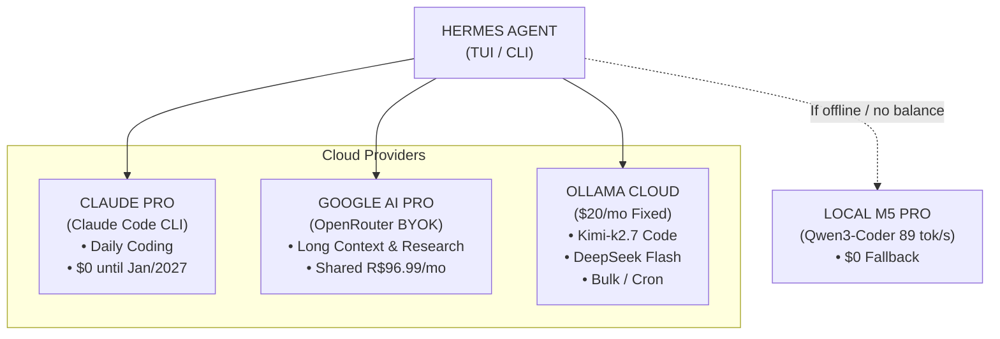

# How I Retired R$200/month in Cloud LLMs with an M5 Pro 48GB and a Hybrid Pipeline using Claude, Gemini, and Ollama

If you use autonomous terminal agents like [Hermes Agent](https://hermes-agent.nousresearch.com/docs) for daily automation, you know that the biggest bottleneck isn't AI capability — it's your bank balance.

Recently, I found myself stuck in a frustrating cycle: a $20/month subscription on [Ollama Cloud](https://ollama.com/cloud) that ran out of credits mid-week. My Kanban automations, journal summarizers, and background cron jobs would suddenly crash with the dreaded `HTTP 402: Payment Required` error. Tasks were left marked as `(no response)` on the board, and my agent was left completely blind.

On my desk sat a MacBook Pro with an M5 Pro chip and 48GB of unified RAM. I had an active [Claude Pro](https://www.anthropic.com/claude) subscription valid through January 2027 (a 1-year perk from a previous employer). I had a [Google AI Pro](https://ai.google.dev/) 5 TB plan for R$96.99/month, which I share with my siblings. And despite all that, I was paying for cloud APIs and getting left stranded.

Well... let's get straight to the point.

> **📋 Visual Architecture Summary:**
>
> | Component | Before | After |
> |---|---|---|
> | **Primary Model** | `glm-5.2` (Ollama Cloud) | `kimi-k2.7-code` (30% fewer thinking tokens) |
> | **Heavy Coding** | Token-paid Cloud API | Claude Pro via `claude-task` CLI ($0 marginal cost) |
> | **Research / 1M Context** | Expensive Cloud | Gemini 3.6 Flash / Pro via OpenRouter BYOK |
> | **Bulk / Cron Jobs** | GLM-5.2 in Cloud (burned balance) | `deepseek-v4-flash:0731` (13 auxiliary slots) |
> | **Local Fallback** | None (halted on 402) | `qwen3-coder-30b-local` (86 tok/s on llama-server) |
> | **Marginal Cost** | ~R$200/month | **~R$17/month** (~R$180/month savings) |

## The Real Cost Breakdown

The table above shows the **marginal** cost of the [LLM](/en/notes/glossary#LLM) pipeline — that is, how much extra I spend directly due to API calls. But it's important to be transparent about what I was already paying before this re-architecture, because parts of this stack are shared or currently cost me nothing extra:

- **Google AI Pro (5 TB):** R$96.99/month. I already keep this recurring plan because I share the storage and AI benefits with my siblings. So it doesn't count as a new pipeline cost — it's a subscription I would have anyway.
- **Claude Pro:** R$0 for me until January 2027, thanks to a 1-year subscription gifted by my previous company. After that, I'll evaluate whether to renew or migrate even more workloads locally.
- **[OpenRouter](/en/notes/glossary#OpenRouter) [BYOK](/en/notes/glossary#BYOK):** I top up about $40 every 3 months to use Gemini via [BYOK](/en/notes/glossary#BYOK) on [OpenRouter](https://openrouter.ai/). It's an occasional pay-as-you-go charge that covers deep research and long-context sessions.
- **Ollama Cloud:** $20/month, which used to blow past limits halfway through the month and freeze everything.

The marginal cost of **~R$17/month** in the new pipeline comes down to an optimized Ollama Cloud usage (which no longer runs out of tokens) plus OpenRouter top-ups spread across several months. Google AI Pro and Claude Pro are costs I already had (or pay $0 for), so they don't count as new expenses. The real savings come from stopping the wasteful burn of extra credits and token-priced APIs for every single task.

## The Real Reason: It's Not Just Savings, It's Sovereignty

If I only focused on the money, I would be dishonest with myself. What truly bothered me wasn't just the invoice amount — it was **dependency**. With every 402 error, I was reminded that my agent, my journal, my Kanban board, and several personal projects were hostages to an API that someone could turn off, rate-limit, or reprice at any given moment.

This directly conflicts with how I like to work. I grew professionally reading open source code, running home servers, building with tools that respect the Unix philosophy of "doing one thing and doing it well," and opting for suckless/DIY approaches whenever possible. Paying tens of dollars a month to a big tech company to process my data in the cloud, when I already had a Mac M5 Pro with 48GB of unified RAM sitting idle on my desk, simply made no sense.

So this shift is part of a broader migration: **from corporate plans to an open source first stack**. The goal isn't merely saving R$180/month — it's aiming to own my data, my daily workflow tools, and the decisions about who receives my tokens, when, and why. When the model runs right here, inside my Mac, the context never leaves my machine. That's what makes a local setup truly priceless.

## The Trigger: Running Out of Credits on a Wednesday

I use [Hermes Agent](https://hermes-agent.nousresearch.com/docs) for almost everything: managing my Kanban board in [SQLite](https://www.sqlite.org/), summarizing daily logs in my [Obsidian](https://obsidian.md/) journal, running cron jobs every 30 minutes, and assisting in hardware development like my [Zuko](/en/posts/zuko-pedal-marshall-diy) guitar pedal.

The problem with an autonomous agent is that it is **token-hungry**. A single tool-execution loop can trigger 10 tool calls. When you have a background cron job firing a summarizer every 30 minutes, your token quota vanishes before you even notice.

On July 31st, and again on August 1st, I checked my journal logs and spotted a string of 402 errors. The agent tried to run, Ollama Cloud hit zero balance, and the task just died.

That was the moment I stopped everything to fix the root cause: I needed a **4-tier hybrid strategy**.

## The "Rapid-MLX" Trap and the Hallucination Test

Before diving into hands-on configuration on my Mac, I decided to ask two AI models for advice on optimizing Hermes on macOS with 48GB of RAM. The contrast between the two AI-generated articles was a great educational reminder of why **we should never blindly trust generated text**.

The first article (generated via DeepSeek) hallucinated from start to finish. It told me to install a non-existent library named **"Rapid-MLX"** that allegedly achieved 120 tok/s on M5 Pro, recommended fake models like `LFM2.5-8B-A1B` and `gpt-oss-20b`, and invented `llama.cpp` flags that don't exist.

The second article (generated via Gemini) was technically flawless: it recommended `llama.cpp` compiled with [Metal](/en/notes/glossary#Metal) acceleration, `-ngl 999`, [KV Cache](/en/notes/glossary#KV Cache) quantized to `q8_0`, and a `launchd` setup to run as a macOS [daemon](/en/notes/glossary#daemon).

The lesson was clear: Gemini's architecture recommendations were solid, but I still needed to test everything on real hardware.

## Phase 1: The Nightmare of Reasoning Models on M5 Pro

I installed the real [llama.cpp](https://github.com/ggml-org/llama.cpp) on macOS using [Homebrew](https://brew.sh/):

```sh
brew install llama.cpp
```

I downloaded `unsloth/Qwen3.5-27B-GGUF` (Q4_K_M 16GB quantization) to test on my M5 Pro. I spun up `llama-server` with full GPU acceleration via [Metal](/en/notes/glossary#Metal):

To run `llama-server` with all Apple Silicon optimizations enabled:

```sh
/opt/homebrew/bin/llama-server \
  --model ~/models/Qwen3.5-27B-Q4_K_M.gguf \
  --alias qwen3.5-27b-local \
  --port 8131 \
  -ngl 999 \
  -c 65536 \
  -fa on \
  --cache-type-k q8_0 \
  --cache-type-v q8_0 \
  --mlock
```

The [GGUF](/en/notes/glossary#GGUF) comes from [Hugging Face](https://huggingface.co/) via [Unsloth](https://unsloth.ai/). If you want to download it manually, use `huggingface-cli`:

```sh
pip install huggingface-hub
huggingface-cli download unsloth/Qwen3.5-27B-GGUF \
  --include "*Q4_K_M.gguf" --local-dir ~/models
```

It booted up right away! But when I sent a basic greeting ("Hello, what are you?"), I suffered my first big shock: **the model took 132 seconds to answer.**

Why? Because Qwen3.5 is a [Reasoning Model](/en/notes/glossary#Reasoning Model). Before replying "I am an assistant," it generated **1,904 tokens** of internal [Thinking Tokens](/en/notes/glossary#Thinking Tokens). Since inference speed on the M5 Pro chip for this dense architecture sat around ~15 tokens per second, I was waiting over 2 minutes just for a simple greeting!

For an interactive terminal or Telegram agent, this was **completely unusable**.

## Phase 2: Salvation with MoE — Qwen3-Coder-30B

The problem wasn't the hardware or `llama.cpp` — it was the **model architecture**. I didn't need a model that spent 2 minutes thinking about how to say hello. I needed a direct instruction model, specialized in programming and [Tool Calling](/en/notes/glossary#Tool Calling), that was **blazing fast**.

That's when I downloaded `unsloth/Qwen3-Coder-30B-A3B-Instruct-GGUF` (Q4_K_M, ~17GB).

This model uses a [MoE](/en/notes/glossary#MoE) (Mixture of Experts) architecture: although it has 30 billion total parameters, it activates **only 3 billion parameters per token** during inference.

The performance on the M5 Pro was incredible.

Here are the real benchmarks I measured:

| Metric | Qwen3.5-27B (Reasoning) | Qwen3-Coder-30B-A3B (MoE) |
|---|---|---|
| **Response Latency ("Hello")** | 132.3 seconds | **0.6 seconds** |
| **Thinking Tokens** | 1,904 tokens | **0 tokens** (direct answer) |
| **Generation Speed** | ~14.5 tok/s | **86.6 to 89.1 tok/s** |
| **Tool Calling Latency** | 6.0 seconds | **0.5 seconds** |

Generation speed jumped from 15 tok/s to **nearly 90 tok/s**. A Python code response took 0.3 seconds. [Tool calling](/en/notes/glossary#Tool Calling) execution for terminal commands took half a second.

I saved the server startup script to `~/scripts/hermes-llama-server.sh` and created a macOS [daemon](/en/notes/glossary#daemon) using [launchd](/en/notes/glossary#launchd) with a [plist](/en/notes/glossary#plist) file at `~/Library/LaunchAgents/com.meuusuario.llama-server.plist`, so the server launches automatically whenever the Mac boots up.

Here is the script that launches the local server with Qwen3-Coder-30B:

```sh
#!/usr/bin/env bash
# ~/scripts/hermes-llama-server.sh

exec /opt/homebrew/bin/llama-server \
  --model "${HOME}/models/Qwen3-Coder-30B-A3B-Instruct-Q4_K_M.gguf" \
  --alias qwen3-coder-30b-local \
  --port 8131 \
  -ngl 999 \
  -c 65536 \
  -fa on \
  --cache-type-k q8_0 \
  --cache-type-v q8_0 \
  --mlock \
  "$@"
```

And the `launchd` plist that loads the daemon at login:

```xml
<?xml version="1.0" encoding="UTF-8"?>
<!DOCTYPE plist PUBLIC "-//Apple//DTD PLIST 1.0//EN" "http://www.apple.com/DTDs/PropertyList-1.0.dtd">
<plist version="1.0">
  <dict>
    <key>Label</key>
    <string>com.meuusuario.llama-server</string>
    <key>ProgramArguments</key>
    <array>
      <string>/Users/meuusuario/scripts/hermes-llama-server.sh</string>
    </array>
    <key>RunAtLoad</key>
    <true/>
    <key>KeepAlive</key>
    <true/>
    <key>StandardOutPath</key>
    <string>/tmp/llama-server.out</string>
    <key>StandardErrorPath</key>
    <string>/tmp/llama-server.err</string>
  </dict>
</plist>
```

To load and start the daemon:

```sh
launchctl load ~/Library/LaunchAgents/com.meuusuario.llama-server.plist
launchctl start com.meuusuario.llama-server
```

## Phase 3: The Final 4-Tier Architecture

With the local server running smoothly at 89 tok/s, I didn't have to abandon the cloud entirely. Instead, I established a **smart routing matrix** divided into 4 tiers, utilizing resources I was already paying for.



### 1. Claude Pro via [Claude Code CLI](https://docs.anthropic.com/en/docs/agents-and-tools/claude-code/overview) (Primary Coding — $0 Marginal Cost)
Since Anthropic restricts direct API usage of Claude Pro OAuth tokens in third-party apps, the cleanest workaround was invoking the Claude CLI directly as a subagent inside Hermes.

I created a helper script at `~/scripts/claude-task.sh`:

To delegate heavy refactoring tasks straight to Claude Sonnet or Opus without paying a single cent in extra API fees:

```sh
#!/usr/bin/env bash
# ~/scripts/claude-task.sh

MODEL="claude-sonnet-4-6"
if [ "$2" == "--opus" ]; then
    MODEL="claude-opus-4-8"
fi

exec claude -p "$1" \
    --model "$MODEL" \
    --allowedTools "Bash,Read,Write,Edit" \
    --output-format text
```

When Hermes needs to perform a large codebase refactor, it executes `claude-task.sh` in the terminal. Responses arrive in 3 seconds with pristine code quality, fully utilizing my existing Claude Pro account.

### 2. Google AI Pro via [OpenRouter BYOK](https://openrouter.ai/) (Research & Long Context)
Using OpenRouter's BYOK integration inside Hermes, I route tasks to `google/gemini-3.6-flash` and `gemini-3-pro` to analyze entire codebases and perform Deep Research leveraging the 1-million-token context window without consuming Ollama Cloud credits.

### 3. Optimized Ollama Cloud (Automations & Bulk Tasks)
On Ollama Cloud, I tuned my Hermes configuration to stop burning balance unnecessarily:
- **Primary Working Model**: Switched from `glm-5.2` to `kimi-k2.7-code`. Kimi is built for agentic coding and consumes **30% fewer thinking tokens** than standard models.
- **Auxiliary & Cron Jobs**: Mapped all 13 auxiliary slots (summarizers, kanban decomposer, title generator, memory compression) to `deepseek-v4-flash:0731`. It is ultra-cheap and ideal for background tasks.
- **Vision**: Maintained `kimi-k3` for times when the agent needs to analyze screenshots or visual assets.

### 4. Local M5 Pro (Instant Fallback)
If my internet connection drops or cloud quotas hit zero, switching models in Hermes takes a single command:

```
/model local
```

And the agent immediately falls back to `qwen3-coder-30b-local` running on the Mac at 89 tok/s.

Inside Hermes's `config.yaml`, the local model is set up as an OpenAI-compatible provider pointing to `llama-server`:

```yaml
providers:
  local:
    base_url: http://127.0.0.1:8131/v1
    model: qwen3-coder-30b-local
    api_key: any
```

## Validation: 7 Real-World Scenarios

To verify that the local fallback could handle real workload demands, I ran a battery of 7 test scenarios covering my daily workflow:

| # | Use Case Scenario | Real Latency | Result |
|---|---|---|---|
| 1 | **TUI / CLI Quick** | **0.8s** | Responded to direct git commands in PT-BR |
| 2 | **Telegram (Casual)** | **2.3s** | Generated a friendly packing checklist |
| 3 | **Subagent Tool Call** | **0.5s** | Executed `ls -la` with valid JSON arguments |
| 4 | **Cron / Log Summary** | **0.6s** | Produced a formatted `> [!note]` callout for Obsidian |
| 5 | **Coding Patch / Diff** | **0.4s** | Returned a clean, valid unified diff |
| 6 | **Technical Translation** | **0.8s** | Translated while preserving technical terms like *alias* and *404* |
| 7 | **Multi-turn Session** | **0.3s** | Maintained user name and task context seamlessly |

All local responses completed in **under 2.5 seconds**.

## Final Thoughts

The outcome of this re-architecture has been fantastic:

1. **Eliminated Cloud Balance Anxiety**: Background cron and Kanban tasks now run on ultra-efficient models (`deepseek-v4-flash`), costing pennies per day.
2. **Peak Code Quality**: Heavy programming workloads route straight to Claude Sonnet/Opus via CLI at zero extra cost.
3. **Full Redundancy**: If external APIs fail, my M5 Pro responds locally in under 1 second at nearly 90 tokens per second.
4. **Real Financial Savings**: An estimated **R$180/month reduction** in API fees while enjoying a significantly faster, more reliable development setup.

If you run terminal agents on an Apple Silicon Mac with unified memory, here is my takeaway: **avoid heavy reasoning models for local interactive agents** and bet on **MoE models focused on code and instruction following**. The difference in responsiveness is night and day.

> Don't know a term? Check the [Glossary](/en/notes/glossary).
