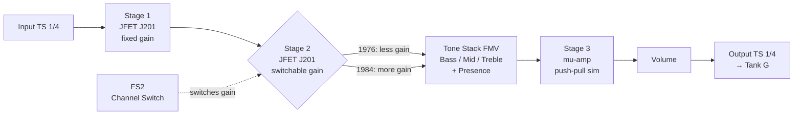
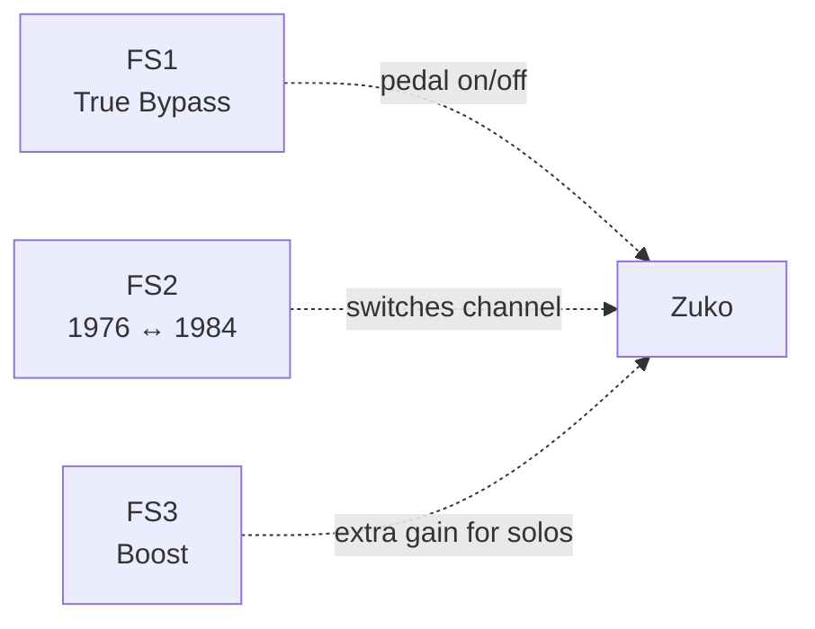

# Zuko: a DIY open hardware Marshall Plexi pedal

I started learning guitar in November 2020, and I decided to do it because I'm a huge Ramones fan. Ever since then I've always wanted Johnny Ramone's tone — that cranked Marshall Plexi (volume maxed out, saturating naturally), everything on 10, aggressive downstrokes, no pedals, no nonsense.

The problem is that a Marshall Super Lead 100 costs more than my car. And even if I had one, I live in an apartment. My neighbors already don't like me.

So I thought: why not build my own "Marshall in a box"? A preamp pedal that sounds like a Plexi, open hardware, hand-built, on an aluminum plate drilled with a power drill. And that covers the ENTIRE Ramones discography — from the first album in 1976 to Adios Amigos in 1995.

And that's where I started from.

## Why "Zuko"?

<center>

</center>

I name my projects after characters from [Avatar: The Last Airbender](https://avatar.fandom.com/wiki/Avatar_Wiki). My ALPS-switch keyboard is called [Appa](https://github.com/Calebe94/appa-firmware), my Cherry MX keyboard is called [Momo](https://github.com/Calebe94/momo-firmware). So the guitar pedal needed an Avatar name too.

Zuko is the prince of fire — literally. The fire element is the warm saturation of the Marshall. Zuko's duality (good vs. evil, prince vs. exile) maps to the pedal's 2 channels: 1976 (raw, controlled) and 1984 (aggressive, furious). And Zuko's redemption arc is the transformation of the raw guitar signal into a full Marshall tone.

Also, `zuko-pcb`, `zuko-firmware`, `zuko-case` follow the same pattern as my keyboard repos.

```
Appa  → ALPS keyboard     → Calebe94/appa-pcb
Momo  → Cherry MX keyboard → Calebe94/momo-pcb
Zuko  → Marshall pedal     → Calebe94/zuko-pcb    ← NEW
```

## The idea: 2 channels for 20 years of Ramones

Johnny Ramone used basically the same rig his entire career: a Mosrite guitar + a Marshall Plexi or JCM800 amp + a 1960A cabinet with Celestion Greenback speakers. He didn't change his tone between albums — the sound evolved through studio production, not through his rig.

For non-guitarists: the **Plexi** is the nickname for the Marshall Super Lead, the '60s tube amp that defined the British rock sound. The **JCM800** is the '80s version, same topology but with more gain. The **1960A** is Marshall's standard 4x12 cabinet (4x 12-inch speakers), and the **Greenback** (Celestion G12M-25) is the speaker that gave that warm, creamy midrange.

But if you listen to the albums carefully, you can tell the sound has **two main voices**:

- **The '70s** (Ramones, Leave Home, Rocket to Russia): raw, less saturation, more twang. The Plexi wasn't fully cranked.
- **The '80s onward** (Road to Ruin, Too Tough to Die, Animal Boy): heavier, more aggressive, scooped mids (with the mid frequencies attenuated, which gives that "hollow" aggressive sound). The amp was saturating harder.

So the pedal needs **2 channels**:

- **"1976" channel**: less gain, raw sound, twang
- **"1984" channel**: more gain, aggressive, scooped

With a footswitch (a pedal button you press with your foot) you switch between the two. From the first to the last album, one pedal covers it all.

```
RAMONES (1976)     Leave Home (1977)    Rocket to Russia (1977)
  ↓ CHANNEL 1976 ↓    ↓ CHANNEL 1976 ↓    ↓ CHANNEL 1976 ↓
  [raw, twang]       [raw, polished]     [bright, pop-punk]

Road to Ruin (1978)  End of Century (80) Too Tough to Die (84)
  ↓ CHANNEL 1984 ↓    ↓ CHANNEL 1984 ↓    ↓ CHANNEL 1984 ↓
  [heavy]            [wall of sound]     [hardcore, aggressive]
```

## The circuit: Runoffgroove Thor (open hardware)

After a lot of research I found the site [runoffgroove.com](https://www.runoffgroove.com/), which is a goldmine for DIY pedal enthusiasts. They take famous tube amp circuits and "convert" them to transistor versions — more specifically JFETs (Junction Field-Effect Transistor, a type of transistor that has a response curve similar to a vacuum tube). They call this "tubes-to-FETs".

The [Thor](https://www.runoffgroove.com/thor.html) is the adaptation of the Marshall 100W Super Lead (Plexi) to pedal form. It uses 3 J201 JFETs that emulate the 3 stages of the Plexi's 12AX7 tube, and it's licensed under Creative Commons BY-NC-SA 3.0 — meaning it's truly open hardware. Schematic, PCB layout, and even photos of the assembled perfboard, all free.

Here's the photo of the assembled Thor pedal, from the runoffgroove site:

<center>

</center>

And the complete circuit schematic:

<center>

</center>

But the original Thor has a problem for our case: it doesn't have the FMV tone stack (the 3-knob EQ circuit — Bass, Mid, Treble — that Marshall has used since the '60s) that the real Plexi has. It uses a custom active filter. And it doesn't have 2 channels.

So I'm modifying the Thor by adding:

1. **Passive FMV tone stack** (Bass/Mid/Treble) between the 2nd and 3rd stage — this is Marshall's classic circuit, documented everywhere. "FMV" is just the name of the passive EQ circuit format used by Fender, Marshall, and Vox since the '60s.
2. **Channel switch** on the 2nd stage — 2 gain values, switchable via footswitch (1976 = less, 1984 = more)
3. **Presence control** in the feedback — like the real amp. The Presence controls the power amp's highs through negative feedback.

This gives me the controls **Gain, Bass, Mid, Treble, Presence, Volume** — exactly like Johnny's Plexi.

### Where to find the schematics

All the Thor files are available for free on the runoffgroove site:

- Complete schematic: [thor.png](https://www.runoffgroove.com/thor.png)
- PCB layout (PDF): [thor-pcb.pdf](https://www.runoffgroove.com/thor-pcb.pdf)
- Perfboard layout: [thor-perf.png](https://www.runoffgroove.com/thor-perf.png)

The PCB was contributed by Pablo De Luca (v1.31, 2007) and is ready to send to JLCPCB or PCBWay for manufacturing.

Here's the perfboard layout (for those who prefer to build without a PCB):

<center>

</center>

And a photo of the assembled perfboard (top and bottom):

<center>

</center>

## The Tank G as cabinet simulator

A preamp alone sounds thin and buzzy. It needs a cabinet (cab) to sound like a real amp — it's the speakers and the wooden box that give the "body" and frequency response we associate with a guitar amp.

And this is where my M-VAVE Tank G comes in.

The Tank G is a compact multi-fx pedal that has:

- **Built-in IR Loader** — loads Impulse Responses of cabinets (`.wav` files that capture the response of a cabinet + speaker + microphone, like a "fingerprint" of that setup's sound)
- **USB Audio Interface** — records and plays audio via USB
- **Digital amp models**
- **Headphone and amp output**

Instead of building an IR loader on a Raspberry Pi (which would be Phase 3 of the project), I use the Tank G I already have. It loads an IR of the Marshall 1960A with Celestion G12M-25 Greenback — exactly the cabinet Johnny Ramone used.

The complete signal chain, visually:

```
Mosrite Kamming          Zuko (this pedal)         Tank G (IR loader)
┌─────────────┐         ┌──────────────┐        ┌──────────────┐
│             │  cable  │              │  cable │              │
│  bridge     │────────→│  3× JFET     │───────→│  IR 1960A    │──→ Phones
│  pickup     │  TS 1/4"│  J201        │  patch │  Greenback   │──→ Amp
│             │         │              │        │              │──→ USB
└─────────────┘         │  2 channels  │        └──────────────┘
                        │  FMV + Pres   │
                        └──────────────┘
```

The signal chain looks like this:

```
Mosrite → Zuko (preamp) → Tank G (IR 1960A) → Phones/Amp
```

The JFET preamp does the organic analog saturation. The Tank G applies the 4x12 cabinet response via digital convolution (mathematical multiplication of the signal and IR spectra). The result sounds like a complete Marshall Plexi, not a buzzy pedal.

The IR I plan to buy is the [Marsh 196A from 3 Sigma Audio](https://www.3sigmaaudio.com/marshall/), which costs US$10 (about R$50) and has multiple microphone positions. It's the exact cabinet Johnny Ramone used.

## The pedal

### Dimensions

| Item | Dimension |
|------|-----------|
| Aluminum plate | 150mm × 100mm × 3mm |
| PCB (Thor mod) | ~60mm × 80mm |
| Alternative enclosure | 1590BB (120×95×35mm) |

3mm thickness is important — it needs to be thick enough to thread footswitches and jacks without bending.

### Top panel

```
┌──────────────────────────────────────────────┐
│         Zuko                                 │
│         150mm x 100mm x 3mm aluminum         │
│                                              │
│  ┌────┐ ┌────┐ ┌────┐                        │
│  │Gain│ │Bass│ │ Mid│                        │
│  └────┘ └────┘ └────┘                        │
│  ┌────┐ ┌────┐ ┌──────┐                      │
│  │Tre │ │Pres│ │Volume│                      │
│  └────┘ └────┘ └──────┘                      │
│                                              │
│  ┌──────┐  ┌─────┐  ┌──────┐                 │
│  │ FS1  │  │ FS2 │  │ FS3  │                 │
│  │Bypass│  │1976/│  │Boost │                 │
│  │      │  │1984 │  │      │                 │
│  └──────┘  └─────┘  └──────┘                 │
│                                              │
│  Sides: [IN TS 1/4"] 9V  ... [OUT TS 1/4"]   │
└──────────────────────────────────────────────┘
```

### Footswitches (3)

| FS | Function | LED | Behavior |
|----|----------|-----|----------|
| FS1 | True Bypass | 🟢 green | On: guitar → AIAB → Tank G. Off: guitar → direct to Tank G. |
| FS2 | Channel 1976 ↔ 1984 | 🟡 yellow | Switches 2nd stage gain. Two Ramones voices. |
| FS3 | Boost/Drive | 🔴 red | Extra gain for solos (Pet Sematary, Poison Heart) |

**True Bypass** means that when the pedal is off, the guitar signal passes straight from input to output without going through any circuitry — as if the pedal doesn't exist. A 3PDT (Triple Pole Double Throw) is the type of footswitch that enables this: it switches 3 circuits simultaneously with one click.

Only 3 footswitches in this phase. The others (play/stop, stem selector, tuner bypass) come in Phase 3 when I add the Raspberry Pi.

### Inputs and outputs

| Connector | Type | Function |
|-----------|------|----------|
| Input | TS 1/4" jack | Guitar (Mosrite) |
| Output | TS 1/4" jack | → Tank G guitar in |
| Power | DC 9V barrel | Standard 9V pedal power supply |
| Green LED | 5mm | FS1 status (bypass) |
| Yellow LED | 5mm | FS2 status (active channel) |
| Red LED | 5mm | FS3 status (boost) |

TS 1/4" (Tip-Sleeve 1/4 inch, or 6.35mm) is the standard guitar connector — that big P2 jack every guitar cable uses.

## Bill of materials

| Item | Qty | Price (R$) |
|------|-----|------------|
| JFET J201 | 3 | ~15 |
| TL072 op-amp | 1 | ~3 |
| Trimpot 10kΩ | 3 | ~9 |
| Pot 100kΩA | 5 | ~25 |
| Pot 25kΩA | 1 | ~5 |
| 3PDT footswitch | 3 | ~60 |
| LED 5mm (green, yellow, red) | 3 | ~6 |
| TS 1/4" jack | 2 | ~15 |
| DC jack 9V | 1 | ~5 |
| Capacitors (22nF, 1µF, 100nF, 0.68µF) | ~20 | ~15 |
| PCB or perfboard | 1 | ~15 |
| Aluminum plate 150×100×3mm | 1 | ~20 |
| **Total** | | **~193** |

R$193. Less than a mechanical keyboard kit. Less than a set of strings and a pack of Dunlop Tortex picks.

## Circuit block diagram





The **mu-amp** in stage 3 is a 2-JFET configuration that emulates the push-pull of the tube power amp — that final stage of the amp that uses two tubes working in opposition (one pushes while the other pulls) to generate power and saturation. The Thor uses this to simulate the power amp saturation of the Plexi, not just the preamp.

## How to test

Before soldering everything onto a PCB, I'll build it on a breadboard to test the sound:

1. Build the Thor circuit on a breadboard following the schematic
2. Add the FMV tone stack between 2nd and 3rd stage
3. Connect guitar → AIAB → Tank G (guitar in)
4. Tank G: select IR 1960A Greenback
5. Tank G: headphones or amp out
6. Play — should sound like a Marshall Plexi + 4x12 cab
7. FS1: test bypass (dry guitar vs. with effect)
8. FS2: test 1976 (raw) vs. 1984 (aggressive)
9. FS3: test boost (crunch → lead)

If the sound is good, then: solder the PCB, mount it on the aluminum plate, and done. Zuko.

## What makes this project ours

1. **DIY and open hardware** — Thor is CC BY-NC-SA 3.0, I can modify and share
2. **2 channels named "1976" and "1984"** — my idea, covers the entire discography
3. **FMV tone stack added** — my modification to the original circuit, doesn't exist on runoffgroove
4. **Tank G integration** — IR loader as cabinet simulator, not in the original project
5. **Name: Zuko** — punk, DIY, engineering, humor
6. **Hand-drilled aluminum plate** — not a commercial PCB, it's mine
7. **Mosrite Kamming → Zuko → Tank G** = complete Johnny Rig

## Next phases

Zuko is only Phase 1 of a larger project — the Vinyl Stem Remover.

- **Phase 1 (now):** Zuko + Tank G — standalone pedal
- **Phase 2:** Buy 3 Sigma Marsh 196A IR (US$10), load it on the Tank G
- **Phase 3:** Raspberry Pi 5 + Demucs (stem separation — removes guitar from vinyl)
- **Phase 4:** Turntable + "1-2-3-4!" count-in from Dee Dee
- **Phase 5:** Complete all-in-one system

But for now, it's just the pedal. A R$193 pedal that sounds like a R$30,000 Marshall.

Gabba Gabba Hey!

## Glossary

This post uses several terms from guitar, electronics, and digital audio. If any are unfamiliar, check the [blog glossary](/en/notes/glossary) — it's updated with every post.

The main terms used here:

| Term | Meaning |
|------|---------|
| **Plexi** | Nickname for the Marshall Super Lead, a '60s tube amp |
| **JFET** | Transistor with a response similar to a vacuum tube, used in place of the 12AX7 |
| **FMV tone stack** | Marshall's 3-knob EQ circuit (Bass/Mid/Treble) |
| **IR** | Impulse Response — a "fingerprint" of a cabinet's sound |
| **True Bypass** | Signal passes straight through without hitting the circuit when the pedal is off |
| **mu-amp** | 2-JFET configuration that emulates power amp push-pull |
| **Scooped mids** | Mid frequencies attenuated — that "hollow" aggressive sound |

Full glossary with all terms: [/en/notes/glossary](/en/notes/glossary).

## References

- [Runoffgroove Thor](https://www.runoffgroove.com/thor.html) — complete circuit, open hardware
- [Runoffgroove Thunderbird](https://www.runoffgroove.com/thunderbird.html) — more aggressive alternative
- [3 Sigma Audio Marsh 196A](https://www.3sigmaaudio.com/marshall/) — Marshall 1960A cabinet IR
- [M-VAVE Tank G](https://www.m-vave.com/) — IR loader + audio interface
- [Creative Commons BY-NC-SA 3.0](https://creativecommons.org/licenses/by-nc-sa/3.0/) — Thor license