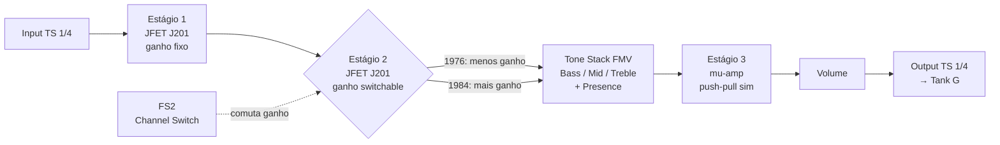
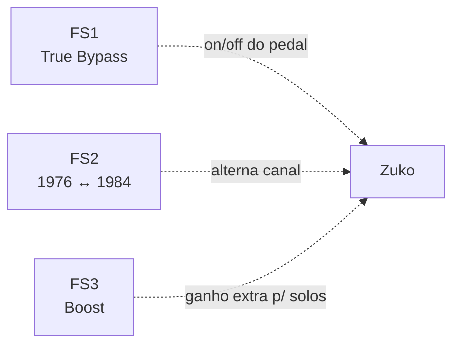

# Zuko: um pedal Marshall Plexi DIY open hardware

Eu comecei a aprender guitarra em novembro de 2020, e decidi isso por ser muito fã de Ramones. Desde então eu sempre quis ter o som do Johnny Ramone — aquele Marshall Plexi cranked (com o volume no máximo, saturando naturalmente), tudo no 10, downstrokes agressivos, sem pedais, sem firulas.

O problema é que um Marshall Super Lead 100 custa mais que meu carro. E mesmo se eu tivesse um, eu moro em apartamento. Meus vizinhos já não gostam de mim.

Então eu pensei: por que não construir o meu próprio "Marshall in a box"? Um pedal preamp (pré-amplificador) que soa como um Plexi, open hardware, feito à mão, numa chapa de alumínio furada com furadeira. E que cubra TODA a discografia dos Ramones — do primeiro álbum de 1976 até Adios Amigos de 1995.

E foi daqui que eu parti.

## Por que "Zuko"?

<center>

</center>

Eu nomeio meus projetos com personagens de [Avatar: The Last Airbender](https://avatar.fandom.com/wiki/Avatar_Wiki). Meu teclado com switches ALPS se chama [Appa](https://github.com/Calebe94/appa-firmware), meu teclado Cherry MX se chama [Momo](https://github.com/Calebe94/momo-firmware). Então o pedal de guitarra precisava de um nome Avatar também.

Zuko é o príncipe do fogo — literalmente. O elemento fogo é a saturação quente do Marshall. A dualidade do Zuko (bem vs. mau, príncipe vs. exilado) são os 2 canais do pedal: o 1976 (cru, controlado) e o 1984 (agressivo, raivoso). E o arco de redenção do Zuko é a transformação do som cru da guitarra em um tom Marshall completo.

Além disso, `zuko-pcb`, `zuko-firmware`, `zuko-case` seguem o mesmo padrão dos meus repositórios de teclado.

```
Appa  → teclado ALPS     → Calebe94/appa-pcb
Momo  → teclado Cherry MX → Calebe94/momo-pcb
Zuko  → pedal Marshall   → Calebe94/zuko-pcb    ← NOVO
```

## A ideia: 2 canais para 20 anos de Ramones

Johnny Ramone usou basicamente o mesmo rig a carreira inteira: uma guitarra Mosrite + um amp Marshall Plexi ou JCM800 + um gabinete 1960A com falantes Celestion Greenback. Ele não mudava timbre entre álbuns — o som evoluiu pela produção de estúdio, não pelo rig dele.

Pra quem não é guitarrista: o **Plexi** é o apelido do Marshall Super Lead, o amp valvulado dos anos 60 que definiu o som do rock britânico. O **JCM800** é a versão dos anos 80, mesma topologia mas com mais ganho. O **1960A** é o gabinete 4x12 (4 falantes de 12 polegadas) padrão da Marshall, e o **Greenback** (Celestion G12M-25) é o falante que dava aquele midrange quente e cremoso.

Mas se você escuta os álbuns com atenção, dá pra notar que o som tem **duas vozes** principais:

- **Os anos 70** (Ramones, Leave Home, Rocket to Russia): cru, menos saturação, mais twang. O Plexi não estava totalmente cranked.
- **Os anos 80 em diante** (Road to Ruin, Too Tough to Die, Animal Boy): mais pesado, mais agressivo, scooped mids (com as frequências médias atenuadas, o que dá aquele som "oco" e agressivo). O amp estava saturando mais.

Então o pedal precisa de **2 canais**:

- Canal **"1976"**: menos ganho, som cru, twang
- Canal **"1984"**: mais ganho, agressivo, scooped

Com um footswitch (botão de pedal que você aperta com o pé) você alterna entre os dois. Do primeiro ao último disco, um pedal só.

```
RAMONES (1976)     Leave Home (1977)    Rocket to Russia (1977)
  ↓ CANAL 1976 ↓     ↓ CANAL 1976 ↓      ↓ CANAL 1976 ↓
  [cru, twang]       [cru, polido]       [brilhante, pop-punk]

Road to Ruin (1978)  End of Century (80) Too Tough to Die (84)
  ↓ CANAL 1984 ↓     ↓ CANAL 1984 ↓      ↓ CANAL 1984 ↓
  [pesado]           [wall of sound]     [hardcore, agressivo]
```

## O circuito: Runoffgroove Thor (open hardware)

Depois de muita pesquisa encontrei o site [runoffgroove.com](https://www.runoffgroove.com/), que é uma mina de ouro pra quem gosta de pedais DIY. Eles pegam circuitos de amps valvulados famosos e "convertem" pra versão em transistor — mais especificamente JFETs ( Junction Field-Effect Transistor, um tipo de transistor que tem uma curva de resposta parecida com a de uma válvula). Eles chamam isso de "tubes-to-FETs".

O [Thor](https://www.runoffgroove.com/thor.html) é a adaptação do Marshall 100W Super Lead (Plexi) pra pedal. Usa 3 JFETs J201 que emulam os 3 estágios da válvula 12AX7 do Plexi, e tem licença Creative Commons BY-NC-SA 3.0 — ou seja, é open hardware de verdade. Esquema, PCB layout, e até fotos da perfboard montada, tudo gratuito.

Aqui está a foto do pedal Thor montado, do site do runoffgroove:

<center>

</center>

E o esquema completo do circuito:

<center>

</center>

Mas o Thor original tem um problema pra nosso caso: ele não tem o tone stack FMV (o circuito de EQ de 3 knobs — Bass, Mid, Treble — que o Marshall usa desde os anos 60) que o Plexi real tem. Ele usa um filtro ativo custom. E ele não tem 2 canais.

Então eu vou modificar o Thor adicionando:

1. **Tone stack FMV passivo** (Bass/Mid/Treble) entre o 2º e 3º estágio — é o circuito clássico do Marshall, documentado em todo lugar. "FMV" é só o nome do formato do circuito de EQ passivo usado pela Fender, Marshall e Vox desde os anos 60.
2. **Channel switch** no 2º estágio — 2 valores de ganho, switchable com footswitch (1976 = menos, 1984 = mais)
3. **Presence control** no feedback — como o amp real. O Presence controla os agudos do power amp através de feedback negativo.

Isso me dá os controles **Gain, Bass, Mid, Treble, Presence, Volume** — exatamente como o Plexi do Johnny.

### Onde encontrar os esquemas

Todos os arquivos do Thor estão disponíveis gratuitamente no site do runoffgroove:

- Esquema completo: [thor.png](https://www.runoffgroove.com/thor.png)
- PCB layout (PDF): [thor-pcb.pdf](https://www.runoffgroove.com/thor-pcb.pdf)
- Perfboard layout: [thor-perf.png](https://www.runoffgroove.com/thor-perf.png)

O PCB foi contribuído por Pablo De Luca (v1.31, 2007) e está pronto pra mandar fabricar no JLCPCB ou PCBWay.

Aqui está o layout da perfboard (para quem prefere montar sem PCB):

<center>

</center>

E uma foto da perfboard montada (topo e bottom):

<center>

</center>

## A Tank G como cab simulator

Um preamp sozinho soa fino e buzzy. Ele precisa de um gabinete (cab) pra soar como um amp de verdade — são os falantes e a caixa de madeira que dão o "corpo" e a resposta de frequência que a gente associa com um amp de guitarra.

E é aqui que entra a minha M-VAVE Tank G.

A Tank G é um pedal multi-fx compacto que tem:

- **IR Loader** embutido — carrega Impulse Responses de gabinetes (arquivos `.wav` que capturam a resposta de um gabinete + falante + microfone, como uma "impressão digital" do som daquele setup)
- **USB Audio Interface** — grava e toca áudio via USB
- **Amp models** digitais
- **Saída para fones e amp**

Em vez de construir um IR loader no Raspberry Pi (que seria a Fase 3 do projeto), eu uso a Tank G que já tenho. Ela carrega um IR do Marshall 1960A com Celestion G12M-25 Greenback — exatamente o gabinete que o Johnny Ramone usava.

O signal chain completo, de forma visual:

```
Mosrite Kamming          Zuko (este pedal)         Tank G (IR loader)
┌─────────────┐         ┌──────────────┐        ┌──────────────┐
│             │  cabo   │              │  cabo  │              │
│  bridge     │────────→│  3× JFET     │───────→│  IR 1960A    │──→ Fones
│  pickup     │  TS 1/4"│  J201        │  patch │  Greenback   │──→ Amp
│             │         │              │        │              │──→ USB
└─────────────┘         │  2 canais    │        └──────────────┘
                        │  FMV + Pres  │
                        └──────────────┘
```

O signal chain fica assim:

```
Mosrite → Zuko (preamp) → Tank G (IR 1960A) → Fones/Amp
```

O preamp JFET faz a saturação analógica orgânica. A Tank G aplica a resposta do gabinete 4x12 via convolução digital (multiplicação matemática dos espectros do sinal e do IR). O resultado soa como um Marshall Plexi completo, não como um pedal buzzy.

O IR que eu pretendo comprar é o [Marsh 196A da 3 Sigma Audio](https://www.3sigmaaudio.com/marshall/), que custa US\$10 (uns R\$50) e tem várias posições de microfone. É o gabinete exato do Johnny Ramone.

## O pedal

### Dimensões

| Item | Dimensão |
|------|----------|
| Chapa de alumínio | 150mm × 100mm × 3mm |
| PCB (Thor mod) | ~60mm × 80mm |
| Enclosure alternativo | 1590BB (120×95×35mm) |

3mm de espessura é importante — precisa ser grosso o suficiente pra rosquear footswitches e jacks sem entortar.

### Painel topo

```
┌──────────────────────────────────────────────┐
│         Zuko                                 │
│         150mm x 100mm x 3mm alumínio         │
│                                              │
│  ┌────┐ ┌────┐ ┌────┐                        │
│  │Gain│ │Bass│ │ Mid│                        │
│  └────┘ └────┘ └────┘                        │
│  ┌────┐ ┌────┐ ┌──────┐                      │
│  │Tre │ │Pres│ │Volume│                      │
│  └────┘ └────┘ └──────┘                      │
│                                              │
│  ┌──────┐  ┌─────┐  ┌──────┐                 │
│  │ FS1  │  │ FS2 │  │ FS3  │                 │
│  │Bypass│  │1976/│  │Boost │                 │
│  │      │  │1984 │  │      │                 │
│  └──────┘  └─────┘  └──────┘                 │
│                                              │
│ Laterais: [IN TS 1/4"] 9V  ... [OUT TS 1/4"] │
└──────────────────────────────────────────────┘
```

### Footswitches (3)

| FS | Função | LED | Comportamento |
|----|--------|-----|---------------|
| FS1 | True Bypass | 🟢 verde | On: guitarra → AIAB → Tank G. Off: guitarra → direto Tank G. |
| FS2 | Channel 1976 ↔ 1984 | 🟡 amarelo | Alterna o ganho do 2º estágio. Duas vozes dos Ramones. |
| FS3 | Boost/Drive | 🔴 vermelho | Ganho extra para solos (Pet Sematary, Poison Heart) |

**True Bypass** significa que quando o pedal está desligado, o sinal da guitarra passa direto do input pro output sem passar por nenhum circuito — como se o pedal não existisse. Um 3PDT (Triple Pole Double Throw) é o tipo de footswitch que permite isso: ele comuta 3 circuitos simultaneamente com um clique.

Só 3 footswitches nesta fase. Os outros (play/stop, stem selector, tuner bypass) vêm na Fase 3 quando eu adicionar o Raspberry Pi.

### Entradas e saídas

| Conector | Tipo | Função |
|----------|------|--------|
| Input | TS 1/4" jack | Guitarra (Mosrite) |
| Output | TS 1/4" jack | → Tank G guitar in |
| Power | DC 9V barrel | Fonte 9V padrão pedal |
| LED verde | 5mm | FS1 status (bypass) |
| LED amarelo | 5mm | FS2 status (canal ativo) |
| LED vermelho | 5mm | FS3 status (boost) |

TS 1/4" (Tip-Sleeve de 1/4 de polegada, ou 6.35mm) é o conector padrão de guitarra — aquele jack P2 grande que todo cabo de guitarra usa.

## Lista de materiais

| Item | Qtd | Preço (R\$) |
|------|-----|------------|
| JFET J201 | 3 | ~15 |
| TL072 op-amp | 1 | ~3 |
| Trimpot 10kΩ | 3 | ~9 |
| Pot 100kΩA | 5 | ~25 |
| Pot 25kΩA | 1 | ~5 |
| 3PDT footswitch | 3 | ~60 |
| LED 5mm (verde, amarelo, vermelho) | 3 | ~6 |
| Jack TS 1/4" | 2 | ~15 |
| DC jack 9V | 1 | ~5 |
| Capacitores (22nF, 1µF, 100nF, 0.68µF) | ~20 | ~15 |
| PCB ou perfboard | 1 | ~15 |
| Chapa alumínio 150×100×3mm | 1 | ~20 |
| **Total** | | **~193** |

R\$193. Menos que um kit de teclado mecânico. Menos que um jogo de strings e um par de palhetas Dunlop Tortex.

## Diagrama de blocos do circuito





O **mu-amp** no estágio 3 é uma configuração de 2 JFETs que emula o push-pull do power amp valvulado — aquele estágio final do amp que usa duas válvulas trabalhando em oposição (uma empurra enquanto a outra puxa) pra gerar potência e saturação. O Thor usa isso pra simular a saturação do power amp do Plexi, não só do preamp.
## Como testar

Antes de soldar tudo numa PCB, eu vou montar em protoboard pra testar o som:

1. Montar o circuito Thor em protoboard seguindo o esquema
2. Adicionar o tone stack FMV entre 2º e 3º estágio
3. Ligar guitarra → AIAB → Tank G (guitar in)
4. Tank G: selecionar IR 1960A Greenback
5. Tank G: fones ou amp out
6. Tocar — deve soar como Marshall Plexi + 4x12 cab
7. FS1: testar bypass (guitarra seca vs com efeito)
8. FS2: testar 1976 (cru) vs 1984 (agressivo)
9. FS3: testar boost (crunch → lead)

Se o som estiver bom, aí sim: soldar PCB, montar na chapa de alumínio, e pronto. Zuko.

## O que torna esse projeto nosso

1. **DIY e open hardware** — Thor é CC BY-NC-SA 3.0, eu posso modificar e compartilhar
2. **2 canais nomeados "1976" e "1984"** — minha ideia, cobre toda a discografia
3. **Tone stack FMV adicionado** — modificação minha do circuito original, não existe no runoffgroove
4. **Integração com Tank G** — IR loader como cab simulator, não tem no projeto original
5. **Nome: Zuko** — punk, DIY, engenharia, humor
6. **Chapa de alumínio furada à mão** — não é PCB comercial, é meu
7. **Mosrite Kamming → Zuko → Tank G** = Johnny Rig completo

## Próximas fases

O Zuko é só a Fase 1 de um projeto maior — o Vinyl Stem Remover.

- **Fase 1 (agora):** Zuko + Tank G — pedal standalone
- **Fase 2:** Comprar IR 3 Sigma Marsh 196A (US\$10), carregar na Tank G
- **Fase 3:** Raspberry Pi 5 + Demucs (stem separation — remove guitarra do vinil)
- **Fase 4:** Toca-discos + count-in "1-2-3-4!" do Dee Dee
- **Fase 5:** Sistema completo all-in-one

Mas por enquanto, é só o pedal. Um pedal de R\$193 que soa como um Marshall de R\$30.000.

Gabba Gabba Hey!

## Glossário

Este post usa vários termos de guitarra, eletrônica e áudio digital. Se algum não for familiar, confira o [glossário do blog](/notes/glossario) — ele é atualizado a cada post.

Os principais termos usados aqui:

| Termo | Significado |
|-------|-------------|
| **Plexi** | Apelido do Marshall Super Lead, amp valvulado dos anos 60 |
| **JFET** | Transistor com resposta parecida com válvula, usado no lugar da 12AX7 |
| **Tone stack FMV** | Circuito de EQ de 3 knobs (Bass/Mid/Treble) do Marshall |
| **IR** | Impulse Response — "impressão digital" do som de um gabinete |
| **True Bypass** | Sinal passa direto sem passar pelo circuito quando o pedal está off |
| **mu-amp** | Configuração de 2 JFETs que emula o push-pull do power amp |
| **Scooped mids** | Frequências médias atenuadas — som "oco" e agressivo |

Glossário completo com todos os termos: [/notes/glossario](/notes/glossario).

## Referências

- [Runoffgroove Thor](https://www.runoffgroove.com/thor.html) — circuito completo, open hardware
- [Runoffgroove Thunderbird](https://www.runoffgroove.com/thunderbird.html) — alternativa mais agressiva
- [3 Sigma Audio Marsh 196A](https://www.3sigmaaudio.com/marshall/) — IR do gabinete Marshall 1960A
- [M-VAVE Tank G](https://www.m-vave.com/) — IR loader + audio interface
- [Creative Commons BY-NC-SA 3.0](https://creativecommons.org/licenses/by-nc-sa/3.0/) — licença do Thor
