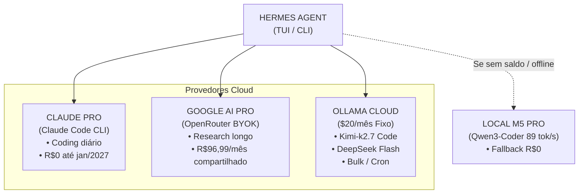

Se você usa agentes autônomos no terminal como o [Hermes Agent](https://hermes-agent.nousresearch.com/docs) para automação diária, sabe que o maior gargalo não é a capacidade da IA — é o saldo da sua conta.

Recentemente eu me vi preso num ciclo frustrante: uma assinatura de $20/mês no [Ollama Cloud](https://ollama.com/cloud) que estourava o limite de créditos no meio da semana. Minhas automações de Kanban, summarizers de journal e cron jobs de background paravam de funcionar do nada com o famigerado erro `HTTP 402: Payment Required`. Tasks ficavam marcadas como `(no response)` no board, e o meu agente ficava cego.

Eu tinha na minha mesa um MacBook Pro com chip M5 Pro e 48GB de RAM unificada. Eu tinha uma assinatura do [Claude Pro](https://www.anthropic.com/claude) ativa até janeiro de 2027 (ganhei 1 ano de uma empresa anterior). Eu tinha o plano [Google AI Pro](https://ai.google.dev/) 5 TB por R$96,99/mês, que divido com os meus irmãos. E mesmo assim, eu estava pagando por API de nuvem e ficando na mão.

Bom... vamos direto ao ponto.

> **📋 Resumo visual da arquitetura:**
>
> | Componente | Antes | Depois |
> |---|---|---|
> | **Modelo Primário** | `glm-5.2` (Ollama Cloud) | `kimi-k2.7-code` (30% menos thinking tokens) |
> | **Coding Pesado** | Cloud pago por token | Claude Pro via `claude-task` CLI (R$0 marginal) |
> | **Research / 1M Context** | Cloud caro | Gemini 3.6 Flash / Pro via OpenRouter BYOK |
> | **Bulk / Cron Jobs** | GLM-5.2 no Cloud (queimava saldo) | `deepseek-v4-flash:0731` (13 slots auxiliares) |
> | **Fallback Local** | Nenhum (parava no 402) | `qwen3-coder-30b-local` (86 tok/s no llama-server) |
> | **Custo Marginal** | ~R$200/mês | **~R$17/mês** (~R$180/mês de economia) |

## A matemática real dos custos

A tabela acima mostra o custo **marginal** do pipeline de [LLM](/pt/notes/glossary#LLM) — ou seja, quanto eu gasto a mais por causa das chamadas de API. Mas acho importante ser transparente sobre o que eu já pagava antes dessa rearquitetura, porque parte dessa stack é compartilhada ou não me custa nada no momento:

- **Google AI Pro (5 TB):** R$96,99/mês. Eu já mantenho esse plano recorrente porque divido o storage e os benefícios de IA com os meus irmãos. Então ele não entra como custo novo do pipeline — é uma assinatura que eu teria de qualquer forma.
- **Claude Pro:** R$0 para mim até janeiro de 2027, porque ganhei 1 ano de assinatura da empresa onde trabalhei anteriormente. Depois disso, terei que decidir se renovo ou migro mais tarefas para o local.
- **[OpenRouter](/pt/notes/glossary#OpenRouter) [BYOK](/pt/notes/glossary#BYOK):** eu coloco uns $40 a cada 3 meses para usar o Gemini via [BYOK](/pt/notes/glossary#BYOK) no [OpenRouter](https://openrouter.ai/). É uma recarga esporádica que cobre research e contexto longo.
- **Ollama Cloud:** $20/mês, que antes estourava no meio do mês e deixava tudo parado.

O custo marginal de **~R$17/mês** no novo pipeline vem basicamente da Ollama Cloud otimizada (que agora não estoura mais) + as recargas do OpenRouter espalhadas pelos meses. O Google AI Pro e o Claude Pro são custos que eu já tinha (ou não tenho), então não pesam como gastos novos. A economia real está em parar de queimar créditos extras e de depender de APIs pagas por token para tudo.

## O verdadeiro motivo: não é só economia, é soberania

Se eu parasse no custo, eu estaria sendo desonesto comigo mesmo. O que realmente me incomodava não era só o valor da conta — era a **dependência**. A cada erro 402, eu lembrava que o meu agente, o meu journal, o meu board de Kanban e vários projetos pessoais estavam reféns de uma API que alguém podia desligar, limitar ou mudar de preço a qualquer momento.

Isso entra em choque direto com a forma como eu quero trabalhar. Eu cresci profissionalmente lendo código aberto, rodando servidores em casa, usando ferramentas que respeitam a filosofia Unix de "fazer uma coisa e fazer bem", e buscando soluções suckless/DIY sempre que possível. Pagar dezenas de dólares por mês para uma big tech processar os meus dados em nuvem, quando eu já tinha um Mac M5 Pro com 48GB de RAM unificada parado na mesa, simplesmente não fazia sentido.

Então essa mudança é parte de uma migração maior: **de planos corporativos para uma stack open source first**. O objetivo não é só economizar R$180/mês — é tentar ser dono dos meus próprios dados, da minha própria ferramenta de trabalho e das decisões sobre para quem, quando e por que eu envio tokens. Quando o modelo roda aqui, dentro do meu Mac, o contexto não sai da minha máquina. É isso que torna o setup local tão valioso.

## A necessidade: quando o saldo acaba na quarta-feira

Eu uso o [Hermes Agent](https://hermes-agent.nousresearch.com/docs) para praticamente tudo: gerenciar meu board de Kanban no [SQLite](https://www.sqlite.org/), resumir logs do dia no meu diário do [Obsidian](https://obsidian.md/), rodar cron jobs a cada 30 minutos, e me auxiliar no desenvolvimento de projetos como o pedal de guitarra [Zuko](/pt/posts/zuko-pedal-marshall-diy).

O problema de um agente autônomo é que ele é **faminto por tokens**. Um único loop de automação pode fazer 10 chamadas de ferramentas. Quando você tem um cron job rodando em segundo plano que dispara um summarizer a cada 30 minutos, a sua quota de tokens evaporava sem você perceber.

No dia 31 de julho, e novamente no dia 1º de agosto, olhei os logs do meu journal e vi uma sequência de erros 402. O agent tentava rodar, o saldo do Ollama Cloud estava zerado, e a tarefa simplesmente morria.

Foi aí que decidi parar tudo e resolver o problema na raiz: eu precisava de uma **estratégia híbrida de 4 camadas**.

## A armadilha do "Rapid-MLX" e o teste da alucinação

Antes de colocar a mão na massa no meu Mac, decidi pedir conselho para duas IAs sobre como otimizar o Hermes no macOS com 48GB de RAM. A resposta que recebi comparando dois artigos gerados por IA foi um lembrete pedagógico de por que **nunca devemos confiar cegamente em texto gerado**.

O primeiro artigo (gerado via DeepSeek) alucinou do começo ao fim. Ele me mandou instalar uma biblioteca chamada **"Rapid-MLX"** que supostamente dava 120 tok/s no M5 Pro, recomendou modelos inexistentes como `LFM2.5-8B-A1B` e `gpt-oss-20b`, e inventou flags do `llama.cpp` que não existem.

Já o segundo artigo (gerado via Gemini) foi tecnicamente impecável: recomendou o `llama.cpp` compilado para [Metal](/pt/notes/glossary#Metal), a flag `-ngl 999`, [KV Cache](/pt/notes/glossary#KV Cache) quantizado em `q8_0`, e um setup do `launchd` para rodar como [daemon](/pt/notes/glossary#daemon) no macOS.

A lição foi clara: a arquitetura do Gemini era sólida, mas eu precisava testar no hardware real.

## Fase 1: O pesadelo do modelo de "Reasoning" no M5 Pro

Instalei o [llama.cpp](https://github.com/ggml-org/llama.cpp) de verdade no macOS via [Homebrew](https://brew.sh/):

```sh
brew install llama.cpp
```

Baixei o modelo `unsloth/Qwen3.5-27B-GGUF` (versão quantizada Q4_K_M com 16GB) para testar no meu M5 Pro. Subi o `llama-server` com suporte total a aceleração de GPU por [Metal](/pt/notes/glossary#Metal):

Para rodar o `llama-server` com todas as otimizações para Apple Silicon:

```sh
/opt/homebrew/bin/llama-server \
  --model ~/models/Qwen3.5-27B-Q4_K_M.gguf \
  --alias qwen3.5-27b-local \
  --port 8131 \
  -ngl 999 \
  -c 65536 \
  -fa on \
  --cache-type-k q8_0 \
  --cache-type-v q8_0 \
  --mlock
```

O [GGUF](/pt/notes/glossary#GGUF) vem do [Hugging Face](https://huggingface.co/) via [Unsloth](https://unsloth.ai/). Se você quiser baixar manualmente, use o `huggingface-cli`:

```sh
pip install huggingface-hub
huggingface-cli download unsloth/Qwen3.5-27B-GGUF \
  --include "*Q4_K_M.gguf" --local-dir ~/models
```

Subiu de primeira! Mas quando mandei uma pergunta simples ("Olá, o que você é?"), passei pelo primeiro grande susto: **o modelo demorou 132 segundos para responder.**

Por quê? Porque o Qwen3.5 é um [Reasoning Model](/pt/notes/glossary#Reasoning Model) (modelo de raciocínio explícito). Antes de responder "Eu sou um assistente", ele gerava **1.904 tokens** de [Thinking Tokens](/pt/notes/glossary#Thinking Tokens) em segundo plano. Como a velocidade no chip M5 Pro para essa arquitetura densa era de ~15 tokens por segundo, eu ficava esperando mais de 2 minutos por uma saudação!

Para um agente interativo no terminal ou no Telegram, isso era **inviável**.

## Fase 2: A salvação com MoE — Qwen3-Coder-30B

O problema não era o hardware nem o `llama.cpp` — era a **arquitetura do modelo**. Eu não precisava de um modelo que pensasse por 2 minutos sobre o que é uma saudação. Eu precisava de um modelo de instrução direto, especializado em código e [Tool Calling](/pt/notes/glossary#Tool Calling), e que fosse **extremamente rápido**.

Foi aí que baixei o `unsloth/Qwen3-Coder-30B-A3B-Instruct-GGUF` (Q4_K_M, ~17GB).

Esse modelo usa a arquitetura [MoE](/pt/notes/glossary#MoE) (Mixture of Experts): embora ele tenha 30 bilhões de parâmetros totais, ele ativa **apenas 3 bilhões de parâmetros por token** durante a inferência.

O resultado no M5 Pro foi inacreditável.

Compare os números reais que medi:

| Métrica | Qwen3.5-27B (Reasoning) | Qwen3-Coder-30B-A3B (MoE) |
|---|---|---|
| **Tempo de resposta ("Olá")** | 132.3 segundos | **0.6 segundos** |
| **Thinking Tokens** | 1.904 tokens | **0 tokens** (resposta direta) |
| **Velocidade de Geração** | ~14.5 tok/s | **86.6 a 89.1 tok/s** |
| **Latência de Tool Calling** | 6.0 segundos | **0.5 segundos** |

A velocidade saltou de 15 tok/s para **quase 90 tok/s**. Uma resposta de código em Python levou 0.3 segundos. O [tool calling](/pt/notes/glossary#Tool Calling) para executar comandos de terminal levou meio segundo.

Configurei o script em `~/scripts/hermes-llama-server.sh` e criei o [daemon](/pt/notes/glossary#daemon) no macOS com [launchd](/pt/notes/glossary#launchd) e [plist](/pt/notes/glossary#plist) em `~/Library/LaunchAgents/com.meuusuario.llama-server.plist` para que o servidor suba automaticamente sempre que o Mac liga.

Esse é o script que sobe o servidor local com o modelo Qwen3-Coder-30B:

```sh
#!/usr/bin/env bash
# ~/scripts/hermes-llama-server.sh

exec /opt/homebrew/bin/llama-server \
  --model "${HOME}/models/Qwen3-Coder-30B-A3B-Instruct-Q4_K_M.gguf" \
  --alias qwen3-coder-30b-local \
  --port 8131 \
  -ngl 999 \
  -c 65536 \
  -fa on \
  --cache-type-k q8_0 \
  --cache-type-v q8_0 \
  --mlock \
  "$@"
```

E o `launchd` plist que carrega o daemon no login:

```xml
<?xml version="1.0" encoding="UTF-8"?>
<!DOCTYPE plist PUBLIC "-//Apple//DTD PLIST 1.0//EN" "http://www.apple.com/DTDs/PropertyList-1.0.dtd">
<plist version="1.0">
  <dict>
    <key>Label</key>
    <string>com.meuusuario.llama-server</string>
    <key>ProgramArguments</key>
    <array>
      <string>/Users/meuusuario/scripts/hermes-llama-server.sh</string>
    </array>
    <key>RunAtLoad</key>
    <true/>
    <key>KeepAlive</key>
    <true/>
    <key>StandardOutPath</key>
    <string>/tmp/llama-server.out</string>
    <key>StandardErrorPath</key>
    <string>/tmp/llama-server.err</string>
  </dict>
</plist>
```

Para carregar e iniciar o daemon:

```sh
launchctl load ~/Library/LaunchAgents/com.meuusuario.llama-server.plist
launchctl start com.meuusuario.llama-server
```

## Fase 3: A arquitetura final de 4 camadas

Com o servidor local voando baixo a 89 tok/s, eu não precisei abandonar a nuvem. Em vez disso, montei uma **matriz de roteamento inteligente** dividida em 4 camadas, aproveitando todos os recursos que eu já pagava.



### 1. Claude Pro via [Claude Code CLI](https://docs.anthropic.com/en/docs/agents-and-tools/claude-code/overview) (Coding Principal — Custo Marginal R$0)
Como a Anthropic bloqueia o uso de tokens OAuth do Claude Pro em apps de terceiros via API direta, a solução elegante foi usar a própria CLI do Claude como subagente do Hermes.

Criei um helper em `~/scripts/claude-task.sh`:

Para delegar tarefas pesadas de código diretamente para o Claude Sonnet ou Opus sem gastar 1 centavo de API:

```sh
#!/usr/bin/env bash
# ~/scripts/claude-task.sh

MODEL="claude-sonnet-4-6"
if [ "$2" == "--opus" ]; then
    MODEL="claude-opus-4-8"
fi

exec claude -p "$1" \
    --model "$MODEL" \
    --allowedTools "Bash,Read,Write,Edit" \
    --output-format text
```

Quando o Hermes precisa fazer uma refatoração grande, ele dispara o `claude-task.sh` via terminal. Resposta em 3 segundos, qualidade de código impecável, usando a minha assinatura do Claude Pro.

### 2. Google AI Pro via [OpenRouter BYOK](https://openrouter.ai/) (Research e Long Context)
Usando a chave BYOK do OpenRouter integrada no Hermes, consigo usar o `google/gemini-3.6-flash` e o `gemini-3-pro` para analisar repositórios inteiros e fazer pesquisas profundas (*Deep Research*) utilizando a janela de contexto de 1 milhão de tokens, sem gastar créditos do Ollama Cloud.

### 3. Ollama Cloud Otimizado (Automações e Bulk)
No Ollama Cloud, ajustei as configurações do Hermes para parar de queimar saldo à toa:
- **Modelo de Trabalho**: mudei de `glm-5.2` para `kimi-k2.7-code`. O Kimi foi feito para código agentico e gasta **30% menos thinking tokens** que os modelos comuns.
- **Auxiliares e Cron Jobs**: configurei todos os 13 slots auxiliares (summarizers, kanban decomposer, gerador de títulos, compressão de memória) para usar o `deepseek-v4-flash:0731`. Ele é ultra-barato e perfeito para tarefas em segundo plano.
- **Visão**: mantive o `kimi-k3` para quando o agente precisa analisar screenshots ou imagens.

### 4. M5 Pro Local (Fallback Instantâneo)
Se a internet cair ou a quota do cloud zerar, basta um comando no Hermes:

```
/model local
```

E o agente passa a usar o `qwen3-coder-30b-local` rodando no Mac a 89 tok/s.

No `config.yaml` do Hermes, o modelo local fica configurado como um provedor OpenAI-compatível apontando para o `llama-server`:

```yaml
providers:
  local:
    base_url: http://127.0.0.1:8131/v1
    model: qwen3-coder-30b-local
    api_key: any
```

## Validação: Os 7 cenários reais

Para ter certeza de que o setup local aguentava o tranco como fallback real, rodei uma bateria de 7 testes simulando todas as superfícies de uso do meu dia a dia:

| # | Cenário de Uso | Latência Real | Resultado |
|---|---|---|---|
| 1 | **TUI / CLI Quick** | **0.8s** | Respondeu comandos git diretos em pt-BR |
| 2 | **Telegram (Casual pt-BR)** | **2.3s** | Gerou lista de viagem amigável |
| 3 | **Subagente Tool Call** | **0.5s** | Executou `ls -la` com argumentos válidos em JSON |
| 4 | **Cron / Resumo de Log** | **0.6s** | Gerou callout `> [!note]` formatado para o Obsidian |
| 5 | **Coding Patch / Diff** | **0.4s** | Retornou um diff unificado válido |
| 6 | **Tradução Técnica** | **0.8s** | Traduziu preservando termos como *alias* e *404* |
| 7 | **Sessão Multi-turn** | **0.3s** | Manteve o contexto do nome e trabalho sem vacilar |

Todas as respostas locais vieram em **menos de 2.5 segundos**.

## Considerações Finais

O resultado dessa rearquitetura foi sensacional:

1. **Aposentei a dependência de saldo cloud**: Minhas tarefas automáticas do cron e do Kanban agora usam modelos ultra-eficientes (`deepseek-v4-flash`), gastando centavos por day.
2. **Qualidade de código no máximo**: O trabalho pesado de código vai direto para o Claude Sonnet/Opus via CLI com custo marginal zero.
3. **Redundância total**: Se tudo falhar, meu M5 Pro responde localmente em menos de 1 segundo a quase 90 tokens por segundo.
4. **Economia real**: Uma redução estimada de **R$180/mês** no consumo de APIs, mantendo uma experiência de desenvolvimento muito mais rápida e confiável.

Se você também roda agentes no Mac e tem um chip M-series com memória unificada, fica a dica: **fuja de modelos de reasoning denso para agentes interativos localmente** e aposte em modelos **MoE focados em código e instrução**. A diferença de usabilidade é o dia e a noite.

> Não sabe algum termo? Consulte o [Glossário](/pt/notes/glossary).

